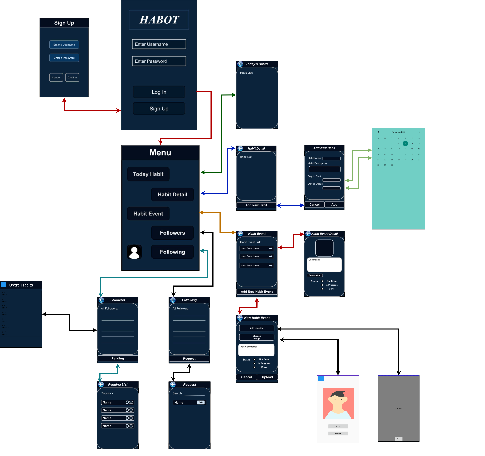

# Project description
We were developing a Android app designing for people want to share their habbit. They can also have their daily event which we called it habit event.
This app need to be easy to use, 

# User requirement
Let's start with the requirement we need to fullfil.

```diff
NOTE:
+ The US we've already DONE
- The US we haven't done yet
() update part
```

### Habit:
```diff
+ #### US 01.01.01 (Risk-Low)
+ * App needs to prompt users to add Habit. 
+ * App needs to allow users to give their habits brief title, reason, date to start (and whether it is public or private).

+ #### US 01.02.01 (Risk-Medium)
+ * App needs to allow users to (have a plan for what days of the week a habit should regularly occur).

+ #### US 01.03.01 (Risk-Low)
+ *  App needs to allow users to view their habit details.

+ #### US 01.04.01 (Risk-Low)
+ * App needs to prompt users to edit Habit.

+ #### US 01.05.01 (Risk-Low)
+ * App needs to prompt users to delete Habit (delete any corresponding habit event)

+ #### US 01.06.01 (Risk-Low)
+ * App needs to restrict the habits title up to 20 characters and reason up to 30 characters

+ #### US 01.07.01 (Risk-Low)
+ * App needs to allow users to check their daily Habits.

+ #### US 01.08.01 (Risk-Low)
+ * App needs to allow users to view all their Habits.

+ #### US 01.08.02 (Risk-High)
+ * App needs to allow users to (rearrange their habits in the list as they wish).

+ #### US 01.09.01 (Risk-High)
+ * App needs to display a visual indicator for users' habit List.
```

### Habit Event:
```diff
+ #### US 02.01.01 (Risk-High)
+ * App needs to allow users to denote the status(Not Done/In Progress/Done) of a Habit Event.

+ #### US 02.02.01 (Risk-Medium)
+ * App needs to allow users to comment on Habit Event.
+ * App needs to restrict the comment up to 20 characters

+ #### US 02.03.01 (Risk-Low)
+ * App needs to allow users to upload photographs for a Habit Event.

+ ### US 02.03.02 (risk-highest)
+ * App needs to allow users to (use the camera to upload the photographs).

+ #### US 02.04.01 (Risk-Medium)
+ * App needs to allow users to view the event detail.

+ #### US 02.05.01 (Risk-Medium)
+ * App needs to prompt users to edit Habit Events.

+ #### US 02.06.01 (Risk-Medium)
+ * App needs to prompt users to delete Habit Event.

+ #### US 06.01.01 (Risk-Medium)
+ * App needs to allow users to add an optional location to the event.

+ #### US 06.01.02 (Risk-Medium)
+ * App needs to allow users to record the device's current location for a Habit Event.
```

### User & UserProfile:
```diff
+ #### US 03.01.01 (Risk-Low)
+ * App needs to allow users uniquely identifiable by the system.

+ #### US 05.01.01 (Risk-Medium)
+ * App needs to allow users to pull requests to follow others’ Habits(all).

+ #### US 05.02.01 (Risk-High)
+ * App needs to prompt users to grant or deny others’ the request of following my Habits.

+ #### US 05.03.01 (Risk-High)
+ * App needs to allow users to view the habits and visual indicators of others that granted to follow.

```

#Translation
When we see all these stuff we need to fullfill, we need to figure out what method we can approach to the goal.

  <center>
  </center>
  
  <center>Fig. 1. The user interface designing of our app.</center>


When the users press the app icon, the users will be directed to the Sign In Page.

``` diff
+ (US 03.01.01)
```
In the Sign In Page, there is our app name, username input area, password input area, LOGIN button, 
and the SIGN UP button, from the top respectively.

The users will be required to use the keyboard to enter a unique username and its password to be uniquely identified by the app; 
If the users do not have an account or username, users can press the SIGN UP.

After pressing the SIGN UP button, the users will be able to enter the username and password. 
The CLEAR button will clear all the characters in both input areas; Once the users press the CONFIRM button, 
if the username is taken by somebody else or is empty(null), warning messages will be displayed on the screen;
an Empty password is also not allowed. If the users want to quit creating an account, 
just press the blue return button on the left top corner. 
The return button and CONFIRM button both will direct the user back to the Sign In Page.
Once the user enters an existing and correct username and password, 
then the users will need to use a finger or cursor to press the LOGIN button.

When the users in the Menu Page. There are Today Habit, Habit Detail, Habit Event,
Followers and Following Button, from the top respectively.

``` diff
+ (US 01.07.01) (US 01.09.01)
```
When the users press the TODAY HABIT button in the Menu, users will be able to view today's habits. 
It is a list to show the content, on the left side of the list shows the name of the habits, 
and on the right of the list is the visual indicators to show the progress of habits event has done 
because a habit can have multiple habit events a different time.

The blue button on the left top corner is the button redirected back to the menu page.

``` diff
+ (US 01.03.01)
```
When the users press the HABIT DETAIL button in the Menu, users will be able to see all 
of their habit that has been recorded in the list.

``` diff
+ (US 01.08.02)
```
The app also allows users to rearrange the order of habits, users just need to enter 
two names of habits and tap on the swap, then two of the habits will switch their position.

On the left side of the list, it shows the habit name and the visual indicators on the right side of the list.

``` diff
+ (US 01.01.01) (US 01.02.01) (US 01.06.01)
```
At the bottom, there is an ADD NEW HABIT button, this will allow the users to add a new habit. 
When users tap the button, they will be directed to Add New Habit Page. On this page, there are Habit Name,
Habit Description, Day to Start, Days selection, and Privacy Button from the top respectively. 
Users can tap the DAY TO START button to select a date to start this habit, and the day of a week to execute the habit. 
The Privacy button will allow users to set the privacy of this habit, other users will only be able to see your public status habits. 
There are two buttons at the bottom, CANCEL and ADD button; When the users tap the CANCEL button, 
the user will decline to add new habit, and will be directed back to Habit Detail Page; 
When users press the ADD button, they will be directed back to Habit Detail Page and is able to see a newly added habit in the list.
Note: the Habit name length and Reason length are restricted to be 20 and 30 characters respectively.

``` diff
+ (US 01.04.01) (US 01.05.01)
```
In the Habit Detail Page, when users tap on every individual habit, they can view the detail of this habit, and they can edit the details in the habit as they want(except Habit Name, because you can add a new habit of a different name if you want a different habit name) When the users tap on the DELETE button at the bottom, the habit will be deleted from the list.
When users tap on the blue return button on the left top corner, they will be taken back to Menu Page.

``` diff
+ (US 02.01.01) (US 02.02.01) (US 02.03.01)
+ (US 02.03.02) (US 06.01.01) (US 06.01.02)
```
When the users press the Habit Event Button, users will be able to see the Habit Event that is created by users, which will display the Habit Name and the Habit Event Time;

The button at the bottom is an Add New Habit Event Button, which is able to allow users to add a habit event depending on the existing habit. In the Add New Habit Event, users are allowed to add an optional geolocation users tap on the ADD LOCATION button, and users will be able to add an optional image to the Habit Event once they click on the ADD IMAGE button. The Status needs to be set manually by the users, it just indicates the three statuses of this habit event. Note: the length of the comment is restricted to 20 characters, and time is always required. When users tap on the UPLOAD button, this new habit event will be displayed on the habit event list; And if the users press the CANCEL button, this action will be considered as giving up adding a new habit event.

``` diff
+ (US 02.04.01) (US 02.05.01) (US 02.06.01)
```
When the users in the Habit Event Page, and when the users press on every individual habit event, users will be directed to the habit event detail page, it will display the habit event image, Comment, Geolocation, Status and time of the habit event, the users will be able to edit some details. When users click on the DELETE button, this habit event will be deleted; the UPDATE button is to save the changed details.
When the users press the blue return button on the left top corner, it will go to the Menu page.

```diff
+ (US 05.02.01) (US 05.03.01)
```
Tap the FOLLOWERS button on the Menu, here will display the followers of yours, which means they are granted to browse your public habits and add them to their own habit list.

When the users press the PENDING button at the bottom, there are unresolved requests sent from other users, here the users can choose to grant or deny the requests.
When the users press the blue return button on the left top corner, it will go to the Menu page.

```diff
+ (US 05.01.01)
```
Tap the FOLLOWING button on the Menu, here will display the users you are following which means you are granted to browse their public habits and add them to your own habit list. When the users press the REQUEST button at the bottom, you can search for the Username of other users to pull a request to them.

When the users press the blue return button on the left top corner, it will go to the Menu page.
